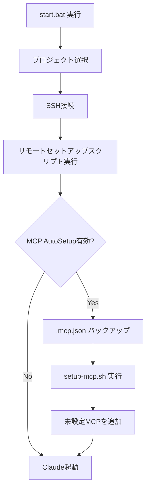

# MCP Auto-Setup 機能ドキュメント

## 概要

Claude Code 起動時に、指定された MCP サーバーが `.mcp.json` に設定されているかを自動チェックし、未設定の場合は自動的に追加する機能です。

## 設定方法

### 1. `config/config.json` の設定

```json
{
  "mcp": {
    "enabled": true,
    "autoSetup": true,
    "requiredServers": [
      "brave-search",
      "ChromeDevTools",
      "context7",
      "github",
      "memory",
      "playwright",
      "plugin:claude-mem:mem-search",
      "sequential-thinking"
    ],
    "githubToken": "Z2hwX...（Base64エンコード済み）"
  }
}
```

#### パラメータ説明

| パラメータ | 説明 | デフォルト |
|-----------|------|-----------|
| `enabled` | MCP機能の有効/無効 | `true` |
| `autoSetup` | 自動セットアップの有効/無効 | `true` |
| `requiredServers` | 必須MCPサーバーのリスト | 上記8つ |
| `githubToken` | GitHub Personal Access Token (Base64) | 空 |

### 2. GitHub Token の設定

GitHub Token は以下の手順で取得・設定します：

1. GitHub → Settings → Developer settings → Personal access tokens → Tokens (classic)
2. "Generate new token (classic)"
3. 必要な権限を選択：
   - `repo` (リポジトリへのフルアクセス)
   - `workflow` (GitHub Actions ワークフローの管理)
4. Token をコピー
5. スクリプト実行時に自動的に Base64 エンコードされて `config.json` に保存されます

## 自動セットアップ対象の MCP サーバー

### 1. brave-search
- **機能**: Brave Search API経由でWeb検索
- **コマンド**: `npx -y @modelcontextprotocol/server-brave-search`
- **要件**: Brave API Key (環境変数 `BRAVE_API_KEY`)

### 2. ChromeDevTools
- **機能**: Chrome DevTools Protocol経由でブラウザ操作
- **コマンド**: `npx -y @automatalabs/mcp-server-chrome-devtools`
- **要件**: なし（環境変数 `MCP_CHROME_DEBUG_PORT` で自動設定）

### 3. context7
- **機能**: ライブラリドキュメント検索・参照
- **コマンド**: `npx -y @context7/mcp`
- **要件**: なし

### 4. github
- **機能**: GitHub API経由でリポジトリ・Issue・PR操作
- **コマンド**: `npx -y @modelcontextprotocol/server-github`
- **要件**: GitHub Personal Access Token (環境変数 `GITHUB_PERSONAL_ACCESS_TOKEN`)

### 5. memory
- **機能**: セッション間のメモリ永続化
- **コマンド**: `npx -y @modelcontextprotocol/server-memory`
- **要件**: なし

### 6. playwright
- **機能**: Playwright経由でブラウザ自動化（E2Eテスト）
- **コマンド**: `npx -y @executeautomation/playwright-mcp-server`
- **要件**: なし

### 7. plugin:claude-mem:mem-search
- **機能**: Claude専用メモリ検索
- **コマンド**: `npx -y @anthropic/claude-mem`
- **要件**: なし

### 8. sequential-thinking
- **機能**: 段階的思考プロセスの実行
- **コマンド**: `npx -y @modelcontextprotocol/server-sequential-thinking`
- **要件**: なし

## 動作フロー



## セットアップスクリプトの動作

`scripts/mcp/setup-mcp.sh` は以下の処理を実行します：

1. **既存設定の読み込み**: `.mcp.json` を読み込み（存在しない場合は新規作成）
2. **MCPサーバーのチェック**: 各必須サーバーが設定済みか確認
3. **未設定サーバーの追加**: 設定されていないサーバーを自動追加
4. **GitHub Token の注入**: Base64デコードしてGitHub MCPの環境変数に設定
5. **設定の保存**: 更新された `.mcp.json` を保存
6. **結果の表示**: 追加/スキップした数と設定済みサーバー一覧を表示

## バックアップ

`.mcp.json` は毎回バックアップされます：

- バックアップファイル名: `.mcp.json.bak.YYYYMMDD-HHMMSS`
- バックアップ場所: プロジェクトルート
- 例: `.mcp.json.bak.20260215-093045`

復元が必要な場合は、バックアップファイルを `.mcp.json` にリネームしてください。

## トラブルシューティング

### MCPサーバーが起動しない

1. **jqのインストール確認**: リモートセットアップ時に自動インストールされますが、手動確認も可能
   ```bash
   jq --version
   ```

2. **.mcp.json の確認**: 正しく生成されているか確認
   ```bash
   cat .mcp.json | jq '.'
   ```

3. **npx の確認**: Node.js/npm がインストールされているか確認
   ```bash
   npx --version
   ```

### GitHub MCPが認証エラー

1. **Token の確認**: `config.json` の `githubToken` が正しく設定されているか確認
2. **権限の確認**: Token に `repo` と `workflow` 権限があるか確認
3. **有効期限の確認**: Token が有効期限切れでないか確認

### Brave Search が動作しない

1. **API Key の取得**: [Brave Search API](https://brave.com/search/api/) で API Key を取得
2. **.mcp.json の更新**: `brave-search` セクションの `BRAVE_API_KEY` を更新

## セキュリティ

- **GitHub Token**: Base64エンコードされて `config.json` に保存されます（暗号化ではなくエンコード）
- **Token の保護**: `config.json` をリポジトリにコミットしないよう `.gitignore` に追加してください
- **Token の管理**: Token が漏洩した場合は即座に無効化し、新しい Token を生成してください

## 手動設定

自動セットアップを無効にする場合：

```json
{
  "mcp": {
    "enabled": true,
    "autoSetup": false
  }
}
```

この場合、`.mcp.json` は手動で編集する必要があります。

## 参考リンク

- [Model Context Protocol (MCP) Documentation](https://modelcontextprotocol.io/)
- [Claude Code MCP Integration](https://docs.anthropic.com/claude/docs/mcp)
- [GitHub Personal Access Tokens](https://docs.github.com/en/authentication/keeping-your-account-and-data-secure/managing-your-personal-access-tokens)
